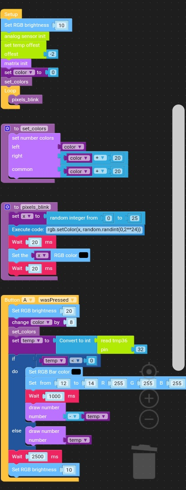
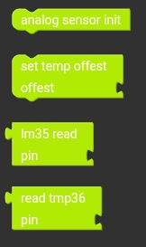
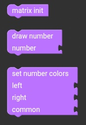

# M5 Atom matrix thermometer.
Simple thermometer application displaying the temperature read on the built-in LED matrix.
The analog temperature sensor TMP36 was used.
After starting the program on the screen, single random pixels blinks. After pressing the button, the temperature and displayed on the LED matrix are read. After about three seconds on the matrix, the flashing pixels are again displayed by shouting the displayed pixel temperature.

Animation shows 21 degree.

## Connection

## UiFlow code

### Notices:
In my case, I had to reduce the temperature of 2°C to be read and the displayed temperature covered with this real. Temperature adjustments can be made using the **set temp offest** block.

At first you must open custom blocks files in UiFlow editor.
- [analog.m5b](analog.m5b)
- [matrix.m5b](matrix.m5b)

Next can open blocky file: [matrix_tmp36_blinks.m5f](matrix_tmp36_blinks.m5f)

## Custom blocks used

### analog.m5b based on [analog.py](src/analog.py) code.

 
 
 **analog sensor init** - Define functions used by below custom blocks.
 
 **set temp offest** - Set a temperature offset that will be added to or subtracted from the temperature reading.
 
 **lm35 read** - Returns the temperature read from the LM35 temperature sensor.
 
 **read TMP36** - Returns the temperature read from the TMP36 temperature sensor.
 
 ### matrix.m5b based on [m5matrix.py](src/m5matrix.py) code.
 
 
 
 **matrix init** - Define functions used by below custom blocks.
 
 **draw number** - Draws the given positive integer from the range [0-99] on the LED matrix.
 
 **set number colors** - Sets the colors for the tens digits, ones and the place where these numbers overlap on the display.
 